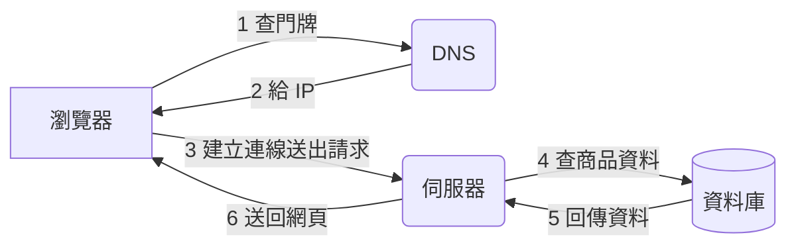

# L1|一個請求的一生:從網址列到畫面出現 📖

🎯 這課結束時:你能用白話講出「打開一個網頁的那零點幾秒發生了什麼」——client 做了什麼、server 做了什麼、資料庫在哪個環節被查、資料怎麼一路變成你看到的畫面。
🧩 需要先會:L0 的全景(知道這模組在打哪一場仗)。不需要任何程式背景。
📚 想深挖:MDN Web Docs「How the Web works」;關鍵字:DNS resolution、TCP handshake、HTTP request/response。

## 先問一個你每天做幾十次卻沒細想過的動作

你在瀏覽器打上「好物市集.com」,按下 Enter,零點幾秒後畫面就出現了。
救阿哲的網站之前,得先搞懂這零點幾秒裡到底發生了什麼——之後每一刀砍在哪裡,
都要先知道請求走的是哪一條路。

## 兩個角色:誰問,誰答

網路世界的基本分工只有兩種身份:

- ****client(客戶端)****:你的瀏覽器。它負責「問問題」——使用者點一下,
  它就把這個動作變成一個請求送出去。
- **server(伺服器)**:阿哲租的那台雲端主機。它負責「回答問題」——收到請求,
  去查該查的資料,組一個答案送回來。

這個「一個問、一個答」的分工模式就叫 **client-server 架構**。
你平常用的每一個網站、App,骨子裡都是這個模式的變形。

## 第一站:先找到門牌——DNS

瀏覽器知道你要找「好物市集.com」,但網路上機器彼此其實只認一組數字地址
(像 `34.120.5.9` 這樣的 IP)。「好物市集.com」對電腦來說是給人看的名字,
不是實際地址。

負責把「名字」翻成「地址」的服務叫 **DNS**——你可以想成一本全球共用的
電話簿:你查的是名字,它吐給你電話號碼。這一步通常在幾十毫秒內完成,
而且你的瀏覽器和網路服務商都會把查過的結果**記住一陣子**(這也是一種快取,
先點到為止,之後每一課都會再遇到「記住結果,別重查」這個主題)。

## 第二站:先握手,再說話

拿到 IP 之後,瀏覽器要先跟那台伺服器悄悄「打個招呼」,確認彼此都在線上、
聽得懂對方在說什麼——這一步業界稱作 TCP 交握,你可以想成撥電話時
先聽對方喂一聲、確認通了才開始講重點。確認完,雙方才開始用一套彼此都懂的
「格式」講話——這套格式就是 **HTTP**:瀏覽器發一個「請求」
(我要看首頁 / 我要看某個商品),伺服器回一個「回應」(這是 HTML,自己畫吧)。

你可以把 HTTP 想成信件的固定格式:誰寄的、要什麼、附件是什麼——
雙方照著同一套格式寫信,再怎麼不同的瀏覽器、不同的伺服器都看得懂彼此。

## 第三站:伺服器的工作台

請求送到伺服器,真正的工作才開始。以「好物市集」的商品頁為例,伺服器要:

1. 看懂這個請求要的是「哪個商品」(從網址或參數解析出來)。
2. 去資料庫把那筆商品的名稱、價格、庫存翻出來。
3. 把這些資料套進網頁的樣板,組成一份完整的 HTML。
4. 把 HTML 當作「回應」送回去。

第 2 步——去資料庫翻資料——正是這個模組要打的仗:資料庫翻得快不快、
翻的方式聰不聰明,直接決定爆紅那晚扛不扛得住。

## 回程:資料怎麼變成你看到的畫面

伺服器送回來的 HTML(和附帶的圖片、CSS、JavaScript)抵達瀏覽器後,
瀏覽器負責把這堆文字**畫成**你看到的版面、套上樣式、跑動態效果。
這一步全部發生在你自己的電腦上,伺服器已經沒事了。

## 伏筆:其實有些東西根本不用跑這一趟

你可能發現了:上面每一步都要跑一趟「瀏覽器 ↔ 伺服器」的來回。
但商品圖片、網站的 CSS/JavaScript 這些**幾乎不會變**的東西,每個人打開
都是一模一樣的內容——有沒有可能根本不用每次都跑回阿哲家那台主機?
(先賣個關子,這是模組後段要解的問題,現在只要記得:不是所有請求
都得乖乖走完整套流程。)

## 全景圖

## 收尾一問

用你自己的話說說看:如果拿掉「DNS 查門牌」這一步,直接輸入 IP 打開網站,
理論上行不行得通?那 DNS 到底幫我們省了什麼?

→ 下一課:光懂請求怎麼走還不夠——我們要**親手把「好物市集」跑起來**,
然後親眼看著它被打掛。

## 📇 名詞卡

- **Client-Server 架構** — 網路世界最基本的分工:client(通常是瀏覽器)負責發出請求,server 負責處理並回應。幾乎所有網站、App 骨子裡都是這個模式。
  - 想更深可以想想:MDN Web Docs:How the Web works。
- **DNS(Domain Name System)** — 把好記的網域名稱(如 好物市集.com)翻譯成電腦真正用來連線的 IP 位址,像一本全球共用的電話簿。查過的結果通常會被暫存一陣子,不用每次都重查。
  - 想更深可以想想:關鍵字:DNS resolution、TTL(快取存活時間)。
- **HTTP(HyperText Transfer Protocol)** — 瀏覽器與伺服器之間講話用的共同格式:一份「請求」寫明要什麼,一份「回應」帶回結果。建立連線的底層工作由 TCP 負責,確保雙方先確認彼此在線,才開始用 HTTP 對話。
  - 想更深可以想想:MDN Web Docs:HTTP overview;關鍵字:TCP handshake、request/response。
