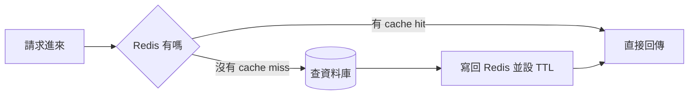

# L4|第二刀:快取 —— 同樣的問題不要問兩次 🔨

🎯 這課結束時:你會在 L2 的 app 上加大約 15 行程式碼,讓「查一次記住答案,之後直接拿現成的」的 **cache-aside** 模式跑起來,並用壓測前後對比證明它真的有效。
🧩 需要先會:L2 的 lab 環境(app 和 Redis 都已經在跑,只是還沒接上)。
📚 想深挖:Redis 官方文件「Caching」;關鍵字:cache-aside、write-through、TTL、cache stampede。

## 情境:爆款商品頁,十萬人看同一筆資料

「好物市集」上一款皮革托特包突然爆紅,十萬人在同一小時內點進同一個商品頁。
這十萬次請求問的其實是**同一個問題**:「這個商品的名稱、價格是多少?」
資料庫卻被逼著一次次重新算同一個答案——L3 加了索引之後這句查詢已經很快,
但「很快」乘以「十萬次」還是很多工作。真正該問的是:第一次算完的答案,
能不能**先記住**,之後直接拿現成的?

## Cache-aside:先查記憶體,miss 才查資料庫

**Cache-aside** 是最常見的快取模式,規則很直白:

1. 請求進來,先去 Redis 問「這筆資料在不在」。
2. **在**(cache hit)→ 直接回傳,完全不碰資料庫。
3. **不在**(cache miss)→ 去資料庫查,把結果**寫回** Redis(順便設一個
   **存活時間 TTL**),再回傳給使用者。

之所以叫「aside(旁路)」,是因為快取不是資料庫的一部分,是 app 自己在
資料庫「旁邊」多加的一層記憶。



## 動手:在 L2 的 app 上加快取

`app/main.py` 的 `/products` 端點,原本每次都直接查資料庫。加大約 15 行:

```python
import json
import redis

r = redis.Redis(host="cache", port=6379, decode_responses=True)


@app.get("/products")
def list_products(category: str, limit: int = 20):
    key = f"products:{category}:{limit}"
    cached = r.get(key)
    if cached:
        return json.loads(cached)

    conn = get_conn()
    cur = conn.cursor()
    cur.execute(
        "SELECT id, name, category, price FROM products "
        "WHERE category = %s ORDER BY price LIMIT %s",
        (category, limit),
    )
    rows = cur.fetchall()
    cur.close()
    conn.close()
    result = [
        {"id": row[0], "name": row[1], "category": row[2], "price": row[3]}
        for row in rows
    ]
    r.setex(key, 30, json.dumps(result))
    return result
```

存檔後 `docker compose restart app`(改了程式碼要重啟容器才會生效)。

## 壓測前後對比

跟 L2 一樣的打法,同一個 category:

```bash
docker run --rm williamyeh/hey -z 20s -c 100 \
  "http://host.docker.internal:8000/products?category=leather"
```

第一次跑(冷快取)前幾個請求還是要真的查一次資料庫,但接下來 30 秒內
(TTL 還沒到期)幾乎每一個請求都直接從 Redis 拿現成答案。比較這次的 p95
和加了索引之後的基準線——同樣的並行量,現在資料庫幾乎閒著,p95 應該
明顯更穩、更低。(實際數字因機器而異,看的是「資料庫負擔幾乎歸零」
這個質變。)

## 快取失效之痛

快取不是萬靈丹,它用「資料可能舊一點」換「速度快很多」,代價要想清楚:

- **TTL 怎麼設**:設太短,幾乎跟沒快取一樣;設太長,商品改價之後,
  使用者可能還看到舊價格好一陣子。沒有標準答案,要看「資料多久舊一次
  沒關係」。
- **TTL 到期的瞬間有個經典陷阱**:一個爆款 key 的快取剛好過期,
  同一秒湧入的所有請求會**一起**打穿到資料庫——這叫
  **cache stampede**。這裡先點到為止,真正的解法
  (限流、熔斷這類保護機制)留到後面模組再細講。

## 常見坑

| 症狀 | 原因 |
|---|---|
| 改了商品價格,頁面還是舊的 | 忘了設 TTL,或 TTL 設太長;快取和資料庫永遠有「一段時間可能不一致」的風險,要主動接受或縮短 TTL |
| 快取用越多記憶體越大 | 沒設 TTL 的 key 永久留在 Redis;所有寫入快取的地方都該有存活時間 |
| 兩個使用者看到彼此的資料 | 把「個人化」的資料(購物車、訂單)當成公用資料放進共用快取的 key;個人資料要嘛不快取、要嘛 key 裡帶上使用者 ID |
| 快取一直 miss,好像沒用 | 檢查 key 組法是否每次都不一樣(例如不小心把時間戳也放進 key) |

## 小挑戰

把 TTL 從 30 秒改成 5 秒,重新壓測,觀察 cache miss 出現的頻率有沒有變高。
自我驗收:你能不能講出「TTL 長短」和「資料新鮮度 vs 資料庫負擔」這兩者的
取捨關係?

## 收尾一問

如果商品的價格幾乎不會變,但庫存數字每分鐘都在變,這兩個欄位該用同一個
TTL 嗎?你會怎麼安排?

→ 下一課:快取解決了「重複問題」,但如果連「第一次問」的量都大到一顆
資料庫扛不住呢?第三刀:**讀取副本**。

## 📇 名詞卡

- **Cache-Aside Pattern** — 最常見的快取模式:app 自己先查快取,miss 才查資料庫,查到的結果寫回快取。快取是資料庫「旁邊」多加的一層記憶,不是資料庫本身的功能。
  - 想更深可以想想:Redis 官方文件:Caching → Cache-aside。
- **TTL(Time To Live,存活時間)** — 快取裡一筆資料能活多久,時間到就自動失效。TTL 短代表資料新鮮但快取幫不上什麼忙;TTL 長代表快取很有效但資料可能舊一陣子。
  - 想更深可以想想:Redis 文件:EXPIRE / SETEX 指令。
- **Cache Stampede(快取雪崩/驚群)** — 一個熱門 key 的快取剛好到期,同一瞬間湧入的大量請求一起繞過快取直接打向資料庫,反而造成尖峰過載。常見解法是加鎖只讓一個請求去補資料,或提前續期。
  - 想更深可以想想:關鍵字:cache stampede、thundering herd、lock-based recomputation。
