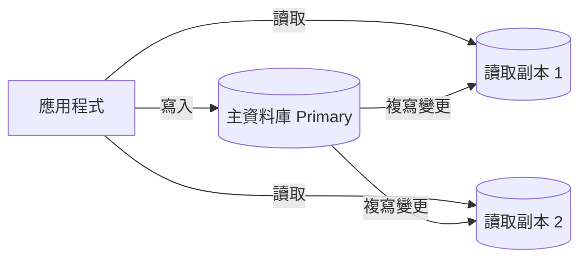

# L5|第三刀:讀取副本 —— 一顆資料庫變成好幾顆 📖

🎯 這課結束時:你能講出「複寫 replication」在做什麼、為什麼讀寫分離能撐住更大的讀取量,以及複寫延遲最常見的一個坑(下單後馬上看不到自己的訂單)怎麼想。
🧩 需要先會:L3 的索引、L4 的快取(這課處理的是前兩刀都用上之後,讀取量還是大到一顆資料庫撐不住的情況)。
📚 想深挖:PostgreSQL 官方文件「High Availability, Load Balancing, and Replication」;關鍵字:primary-replica replication、synchronous vs asynchronous replication、read-your-own-writes。

## 前兩刀用完,還是不夠用的時候

索引讓查詢變快,快取讓重複的問題不用重問——但「好物市集」如果真的紅到
所有人都在看**不同**商品(不是同一個爆款),快取幫不上忙,每個請求還是得
真的問資料庫一次。當**同時要問的問題數**本身就超過一顆資料庫扛得住的量,
剩下的路只有一條:**多蓋幾顆資料庫**。

## Replication:複寫是什麼

**Replication(複寫)** 的概念很直覺:準備好幾份一模一樣的資料庫,
其中一顆當「正本」(primary),其他幾顆是「副本」(replica)。正本上發生的
每一次寫入(新增訂單、改價格),都會被**同步流向**每一顆副本,讓它們的
內容持續跟上。

## 讀寫分離:各司其職

有了副本,分工就很自然:**所有寫入只找 primary**(訂單、改價這些動作只能
有一個「正本」說了算,否則兩顆資料庫各自認定不同版本,會打架);
**讀取則分散到多顆副本**——十個人查商品,可能三個人問 R1、三個人問 R2、
四個人問 primary,每一顆的負擔都變輕。這就是 **讀寫分離**。

好處很明顯:讀取的承載量幾乎能隨副本數量往上疊。代價也很明顯:
**多顆資料庫要花更多錢**,而且——下一段這個坑,是它最有名的副作用。

## 經典坑:下單完,訂單列表怎麼看不到

複寫需要時間,即使通常只有幾毫秒到幾十毫秒。想像這個順序:

1. 使用者按下「送出訂單」→ 寫進 primary。
2. 網頁馬上跳轉到「我的訂單」頁 → 這個讀取請求被分配到某顆副本。
3. 那顆副本**還沒收到**剛剛那筆複寫 → 使用者看不到自己剛下的訂單。

這叫 **read-your-own-writes** 問題:使用者理所當然覺得
「我剛做的事,我應該馬上看得到」,但讀寫分離架構下這件事不是自動保證的。
常見的處理思路(不只一種,依情境選):

- 剛寫入後**短時間內**,同一個使用者的相關讀取**強制走 primary**(不分流)。
- 副本落後太多時**自己知道**(記錄自己複寫到哪個時間點),必要時等一下再讀。
- 有些場景乾脆**接受**短暫看不到(例如「按讚數」慢個一秒更新,沒人會在意)。

哪一種划算,要看「使用者多在意馬上看到自己剛做的事」。

## 同步 vs 非同步複寫,一句話

Primary 可以等副本**確認收到**這筆變更才回覆使用者「寫入成功」
(同步複寫,慢一點但更保證副本跟得上),也可以**不等**、寫完就先回覆
(非同步複寫,快但副本可能暫時落後)——這就是上面那個坑的根源,
兩者是「更慢但更一致」和「更快但可能有落後」之間的取捨。

## 收尾一問

如果「好物市集」的商品瀏覽數(不影響任何決策的統計數字)複寫晚個幾秒
才更新,你覺得這重要嗎?那如果是「庫存剩幾件」呢?兩者該用同一套
複寫策略嗎?

→ 下一課:讀取副本解決了「一顆資料庫撐不住」,但**根本不需要碰到資料庫**
的請求呢?第四刀:**CDN 與負載平衡**。

## 📇 名詞卡

- **Replication 複寫** — 把資料庫內容持續同步複製到多顆機器上:一顆是正本(primary)負責寫入,其他是副本(replica)分擔讀取。副本的內容會跟著正本的變更持續更新,但通常有一點時間差。
  - 想更深可以想想:PostgreSQL 文件:High Availability, Load Balancing, and Replication。
- **讀寫分離(Read-Write Splitting)** — 寫入一律送到 primary,讀取分散到多顆 replica,讓讀取的承載量能隨副本數量往上擴充。
  - 想更深可以想想:關鍵字:read replica、connection routing。
- **Read-Your-Own-Writes** — 使用者剛寫入的資料,理所當然預期自己馬上就能讀到——但在讀寫分離架構下,讀取可能被分配到一顆還沒收到最新複寫的副本,導致「看不到自己剛做的事」。常見解法是關鍵讀取短暫強制走 primary。
  - 想更深可以想想:關鍵字:read-your-own-writes consistency、session consistency。
