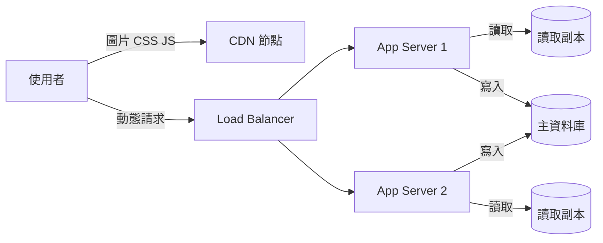

# L6|第四刀:CDN 與負載平衡 —— 流量進門前的分工 📖

🎯 這課結束時:你能分清楚 CDN 和負載平衡各自解決什麼問題、判斷哪些資源適合放 CDN、並且畫出這個模組完整的讀取架構圖。
🧩 需要先會:L1 的請求全景、L5 的讀取副本(這課要把它們兜在一起)。
📚 想深挖:任一大型雲廠商的 CDN 與 Load Balancer 官方文件(例如 CDN 服務、Load Balancing 服務的架構總覽);關鍵字:edge cache、health check、stateless application。

## 兩個問題,兩個角色

前三刀都在讓「一顆資料庫」的讀取扛更多。這課換個角度:**有沒有一部分流量,
根本不需要走到阿哲家那台主機**?還有:多台主機一起服務時,**誰來分工**?

## 角色一:CDN——把不變的東西搬到使用者家附近

商品圖片、網站的 CSS/JavaScript——這些東西**所有人看到的都一樣**,而且
不常變動。與其每個人都跑一趟遠端的伺服器去拿同一張圖,不如把它們**提前
複製一份**到全世界各地離使用者比較近的節點上,使用者連線到最近的節點拿,
連你家伺服器的門都不用敲。這就是 **CDN(Content Delivery Network)**。

判斷什麼適合放 CDN,問自己一句話:「這個東西,全世界的人拿到的是不是
同一份?」

- **適合**:商品圖片、網站的 CSS/JS、影片、公開的靜態頁面。
- **不適合**:使用者的購物車內容、個人訂單——這些是**每個人不一樣**的資料,
  放到共用的 CDN 節點上不但沒用,還可能讓 A 使用者看到 B 使用者的資料。

## 角色二:Load Balancer——把進門的人分給多個窗口

CDN 擋掉了一部分流量,但真正需要「動態運算」的請求(登入、下單、
看個人化推薦)還是得進到阿哲家。當一台主機不夠用,就多開幾台——
但使用者不會自己選要連哪一台,得有人在門口**分流**。這個角色叫
**Load Balancer(負載平衡器)**:它站在最前面接住所有請求,
依照某個規則(輪流、挑目前最閒的)分給後面一台一台的 app server。

Load balancer 還會定期問每台 app server「你還活著嗎」(健康檢查,
health check),一旦某台沒回應就先不分流量給它,故障的機器不會拖累整體。

## 前提:app server 得是「無狀態」的

要讓 load balancer 能隨便把請求分給任何一台 app server,有個前提:
**每台 app server 不能記住「這個使用者剛剛做過什麼」**——如果 app 把使用者的
登入狀態存在某一台機器的記憶體裡,下一個請求被分到別台機器就會「不認得」
這個使用者。解法是把這類狀態存到大家都能存取的地方(例如資料庫、或共用的
快取),app server 本身變成**可以隨時多開一台、少開一台**都不影響正確性的
**無狀態(stateless)**角色。這也是「水平擴充」(多開機器)能成立的
前提。

## 合體:模組一的完整讀取架構

把 L5 的讀取副本和這課的 CDN、load balancer 拼在一起,就是這個模組
四把刀合體後的樣子:

CDN 直接擋掉一大票根本不用進門的流量;load balancer 把剩下的動態請求
分給多台無狀態的 app server;每台 app server 再透過索引、快取、讀取副本
去拿資料——四把刀各司其職,不是互相取代。

## 收尾一問

「好物市集」首頁的商品縮圖適合放 CDN 嗎?那「登入後才看得到的專屬優惠券」
圖片呢?兩者的差異點在哪裡?

→ 下一課:四把刀都學完了——下一步是培養「一台機器到底能扛多少」的手感,
以及一張「網站慢,先查哪裡」的決策樹。

## 📇 名詞卡

- **CDN(Content Delivery Network)** — 把不常變動、所有人看到的內容都一樣的靜態資源(圖片、CSS、JS)提前複製到世界各地離使用者較近的節點,讓請求根本不用進到原始伺服器。
  - 想更深可以想想:任一雲廠商 CDN 服務文件的架構總覽章節。
- **Load Balancer 負載平衡器** — 站在多台 app server 前面,把進來的請求依規則分流過去,並持續做健康檢查,故障的機器會被先排除在分流之外。
  - 想更深可以想想:關鍵字:round robin、least connections、health check。
- **Stateless(無狀態)應用** — app server 本身不記住「特定使用者的狀態」,狀態改存到資料庫或共用快取——這樣任何一台 app server 都能接手任何請求,load balancer 才能自由分流、水平擴充才成立。
  - 想更深可以想想:關鍵字:stateless architecture、session storage、horizontal scaling。
