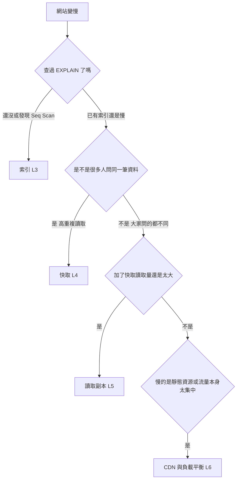

# L7|數量級直覺與決策樹:一台機器到底能扛多少 📖

🎯 這課結束時:你會有「單機資料庫/單機快取/單機 app server 大概是什麼量級」的直覺(不是死背數字),並且拿到一張「網站變慢,先查哪裡」的決策樹,把前面四刀串成一套判斷順序。
🧩 需要先會:L3 索引、L4 快取、L5 讀取副本、L6 CDN/負載平衡——這課是整個模組的整合課。
📚 想深挖:任一雲廠商的資料庫/快取服務規格文件(實際承載量請以官方文件與自家實測為準);關鍵字:back-of-the-envelope calculation、QPS、capacity planning。

## 不背數字,練的是「量級」的手感

系統設計面試最常見的誤區,是想去背「一台機器能撐幾萬人」這種精確數字——
但這數字每天都在變(硬體、雲廠商方案、資料大小都會影響),背了也沒用。
真正該練的是**量級直覺**:單台機器大概是「幾百」「幾千」還是「幾萬」等級,
知道大概落在哪個數量級,才知道什麼時候該加下一把刀。

以下是抓感覺用的**量級**參考(不是承諾值,實際請以官方文件與自己壓測為準):

- **單台一般規格的 PostgreSQL 實例**,簡單索引查詢:量級落在「每秒幾百到
  幾千次」上下,依查詢複雜度、機器規格差很多。
- **單台 Redis**:因為資料整個在記憶體裡,量級通常比資料庫高一到兩個
  數量級,每秒可以到「幾萬」等級。
- **單台 app server**:通常不是它自己的天花板先到,而是它背後打的資料庫
  或下游服務先撐不住。

這也是為什麼四把刀的順序是「索引 → 快取 → 讀取副本 → CDN/LB」——
先把最便宜、最不用加機器的招用完,再考慮真的要花錢加機器的招。

## QPS:量級直覺的共同單位

要比較「扛不扛得住多少」,需要一個共同單位:**QPS(每秒查詢數)**——
每秒有多少個請求打進來。壓測工具(像 L2 用的 hey)報告裡其實就藏著這個
數字(總請求數 ÷ 花費秒數)。有了 QPS 和 p95 延遲兩個數字,你就能大致
回答「這套架構扛不扛得住某個流量規模」。

## 決策樹:網站慢,先查哪裡

這張圖不是死板的規則,是一個**先問便宜的問題**的順序:先看有沒有明顯的
查詢問題(索引),再看有沒有重複計算(快取),再看是不是量真的大到一顆
資料庫扛不住(讀取副本),最後才是流量分工的問題(CDN/LB)。真實世界裡
常常要同時用上好幾把。

## 收尾一問

如果你的網站現在的症狀是「同一個熱門商品頁被十萬人瘋狂重整」,照決策樹
推,你會先檢查什麼、猜測用哪一刀?如果症狀換成「使用者散落在世界各地,
每個人查的商品都不一樣,但圖片載入都很慢」呢?

→ 下一課:四把刀 + 決策樹都到手了——放手課,換你自己給三個病人開藥方。

## 📇 名詞卡

- **QPS(Queries Per Second,每秒查詢數)** — 衡量「扛不扛得住流量」的共同單位:每秒有多少個請求/查詢打進來。壓測工具的報告(總請求數 ÷ 秒數)就能算出這個數字,拿它和延遲數字一起看,才能判斷架構撐不撐得住某個流量規模。
  - 想更深可以想想:關鍵字:QPS、throughput、back-of-the-envelope calculation。
