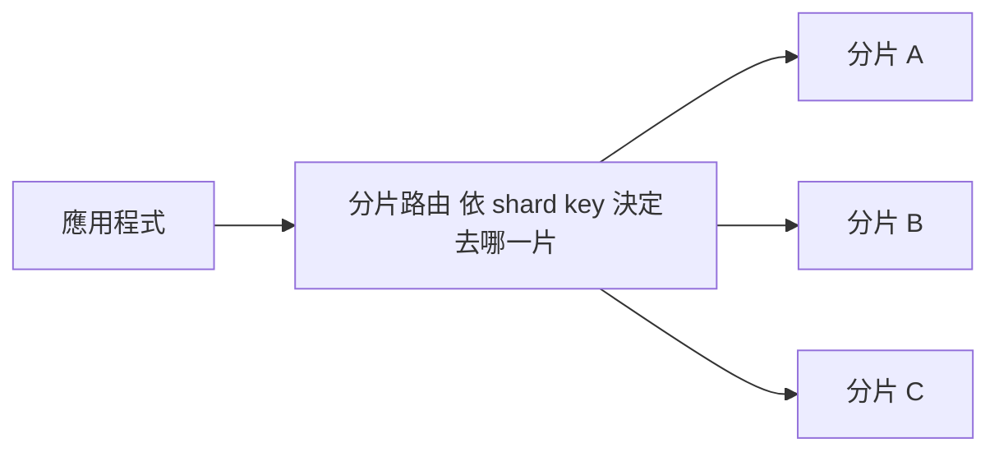

# L5|分片:寫入的最終手段 📖

🎯 這課結束時:你知道為什麼「切開資料庫」是寫入問題的最後一張牌,shard key 怎麼選,以及選錯會有多慘。
🧩 需要先會:L2–L4(交易鎖、分散式鎖、佇列)——這課討論的是「這些武器都用盡之後」的下一步。
📚 想深挖:公開雲端服務商(如 AWS、GCP)的資料庫水平擴展(horizontal scaling)架構文件;關鍵字:sharding、partition key、scatter-gather query。

## 一台資料庫的天花板

L2 到 L4 解決的問題都有一個共同前提:**還是同一台資料庫**。鎖讓寫入變安全,
佇列讓寫入變平順,但不管排得再整齊,最終每一筆訂單都要真正落進**同一台**
資料庫的硬碟裡。一台機器的硬碟寫入速度、CPU、記憶體都是有限的資源——
到了某個規模(量級上,一台機器每秒能扛的寫入次數就是有天花板,實際數字
以你的雲端服務商實測與官方文件為準),不管佇列排得多好,消費者處理的
速度終究被這台機器的物理上限鎖住。這時候,唯一剩下的選項是:
**別再把所有資料都塞進同一台機器。**

## 分片:把資料切成好幾份,各自獨立

**分片 (sharding)** 的想法很直接:把一張大表按照某個規則切成好幾份,
分別放進好幾顆**各自獨立**的資料庫裡。例如把好物市集的 `orders` 表切成三份:

每一片是一顆完整、獨立的資料庫,只裝一部分資料。三片分別處理各自的寫入,
單一機器的天花板就這樣被「橫向」打破——不是買一台更強的機器(垂直擴展的
天花板更快碰到),而是多買幾台普通機器分攤(水平擴展)。

## Shard key:怎麼決定「這筆資料該去哪一片」

決定一筆資料進哪一片的欄位叫 **shard key**。同一個 `orders` 表,
不同的 shard key 選擇,命運差很多:

- **按 `user_id` 雜湊分片**:同一個使用者的訂單永遠落在同一片,寫入平均
  分散到每一片(因為使用者本來就分散),是最常見的安全選擇。
- **按 `category`(商品分類)分片**:平常看起來也很合理——直到週年慶
  當晚,全站流量都衝著「手作包」這個分類來,所有寫入全部擠進裝著
  這個分類的**同一片**,其他兩片閒著沒事做,那一片卻被打爆。

## 選錯 shard key 的熱點災難

上面第二種就是 **熱點 (hotspot)**:表面上你已經「分片」了,系統圖看起來
很漂亮地分成三份,但實際流量根本沒有被分散——爆款商品把所有壓力都
集中在單一分片上,等於白分了,那一片承受的壓力跟沒分片時一樣大,
其他分片的容量完全浪費。**選 shard key 的第一原則:選一個能讓流量
真正均勻打散的欄位**,而不是選一個「邏輯上分類好看」的欄位。

## 分片的代價

分片不是免費的升級,它換來吞吐量的同時,也帶來實實在在的麻煩:

- **跨分片查詢變難**:「這個月全站營收總和」以前一句 `SUM()` 就好,
  分片後得分別查三片再自己加總(scatter-gather),多一層複雜度。
- **跨分片交易變難**:一個操作如果需要同時動到兩片裡的資料,
  沒辦法再靠單一資料庫的 transaction 一次保證 all-or-nothing。
- **擴容要搬家**:業務再成長,想從三片加到四片,舊資料要重新按照
  新規則分配位置——這個「搬家」的過程本身就是一場硬仗
  (下一課的一致性雜湊,就是專門緩解這個痛點的招數)。

正因為代價這麼高,**分片永遠是最後一張牌**:先把索引、快取、
讀取副本、交易鎖、佇列都用到位,真的碰到單機寫入的物理天花板,
才輪到動手切開資料庫。過早分片,等於提早背上這些代價,
卻還沒真正需要它帶來的吞吐量。

## 收尾一問

同事提議:「我們現在就把訂單表按照商品分類先分片,以後比較好擴充。」
用你自己的話說明這個提案潛在的風險是什麼,以及你會建議先做什麼。

→ 下一課:資料切開了,但業務繼續成長,四片不夠要變八片——
舊資料要怎麼搬,才不會整個搬到天翻地覆?

## 📇 名詞卡

- **Sharding(分片/水平分割)** — 把一張大表按某個規則切成好幾份,分別放進各自獨立的資料庫裡,用多台普通機器分攤原本一台機器扛不住的寫入量。
  - 想更深可以想想:公開雲端服務商的資料庫水平擴展文件通常有專章介紹,關鍵字 horizontal scaling / sharding。
- **熱點 (Hotspot)** — 分片後,流量沒有真正被均勻打散,反而集中打在某一片上——表面分了片,實際上那一片承受的壓力跟沒分片一樣大,其他分片的容量被浪費。
  - 想更深可以想想:選 shard key 時最需要提防的風險,見本課「熱點災難」一節。
