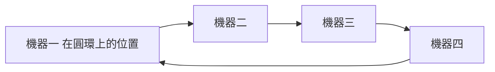

# L6|一致性雜湊:切開之後,加減機器不搬爆 📖

🎯 這課結束時:你能用自己的話解釋一致性雜湊怎麼讓「加一台機器」只影響一小撮資料,而不是全部重新搬家。
🧩 需要先會:L5 的分片概念(尤其是「擴容要搬家」的痛點)。
📚 想深挖:關鍵字 consistent hashing、hash ring、virtual node;Amazon Dynamo 論文(2007)有原始的完整設計。

## L5 留下的痛:加一台機器,幾乎全部要搬家

L5 提到分片最痛的代價是擴容——業務成長,三片不夠要變四片。如果你用最直覺的
分法:算出每筆資料的雜湊值,再對「片數」取餘數(`hash(key) % 片數`),
問題就來了。片數從 3 變成 4,幾乎每一筆資料的 `% 片數` 結果都會跟著改變
(因為除數變了),意味著**幾乎所有資料都要重新搬到不同的分片**——
加一台機器,本來只想多分攤一點壓力,結果卻要把全公司的資料重新洗牌一次。

## 一致性雜湊:把機器和資料都畫在同一個圓上

**一致性雜湊 (consistent hashing)** 換了一種思路,用一個比喻就能懂:

想像一個時鐘造型的圓環,不是 12 個小時,而是一個非常長的刻度圈。
把**每一台機器**算一個位置,標在圓環上;把**每一筆資料**也算一個位置,
標在同一個圓環上。規則很簡單:**一筆資料,交給從它的位置開始、
順時針方向遇到的第一台機器負責**。

(這個圖畫成一條首尾相接的環,想像它真的彎成一個圓——每台機器只管理
「從自己往逆時針方向,到上一台機器之間」那一小段弧。)

## 加減機器,只影響鄰居

好處在這裡:如果在機器二和機器三之間**新增一台機器**,只有原本
「順時針方向本來要交給機器三」、但位置其實落在新機器之前的那一小段資料,
會改交給新機器——**其餘所有資料的歸屬完全不受影響**,因為它們順時針
方向遇到的第一台機器沒有變。同理,拿掉一台機器,只有原本歸屬它的那一段
資料,會自動轉交給圓環上順時針的下一台機器,其他資料一樣不動。

比起「% 片數」那種加一台全部重洗的做法,一致性雜湊把搬家的範圍
從「全部」縮小成「新機器周圍那一小圈」——這就是它解決 L5 痛點的核心。

## 虛擬節點:讓分配更均勻

如果每台實體機器在圓環上只佔一個點,運氣不好時,某台機器可能負責
一大段弧(拿到很多資料),另一台只負責小小一段(幾乎沒事做)——分佈
不均勻。實務上的解法是 **虛擬節點 (virtual node)**:讓每一台實體機器
在圓環上假裝是好幾十、好幾百個點,散布在圓環各處。實體機器背後真正
負責的資料量,變成它那幾百個虛擬點各自負責的小段弧加總起來——
點數一多,統計上自然拉近了每台實體機器分到的資料量,不再看運氣。

## 誰在用

一致性雜湊不是紙上談兵的理論,分散式快取(像 Memcached 的用戶端函式庫)
與不少 NoSQL 資料庫(以 Amazon Dynamo 的設計為代表)內部都靠它決定
「這筆資料該去哪台機器」,加減機器時把資料搬動的成本降到最低。

## 收尾一問

同事問:「反正都要分片,為什麼不乾脆一開始就分好一百片,以後都不用煩惱擴容?」
用你自己的話回答他,並說明一致性雜湊解決的到底是「要不要分片」還是
「分片之後加減機器的成本」這個問題。

→ 下一課:資料一旦分散到多台機器,就進入了一個新的世界——
網路會斷、機器會失聯,這時候「一致」和「可用」不能同時要,這是物理定律。

## 📇 名詞卡

- **一致性雜湊 (Consistent Hashing)** — 把機器和資料都對應到同一個雜湊環上的位置,資料交給環上順時針方向第一台遇到的機器負責。加減機器時只有鄰近的一小段資料需要搬家,不必像 hash % 機器數那樣幾乎全部重新分配。
  - 想更深可以想想:關鍵字 consistent hashing、hash ring;Amazon Dynamo 論文有完整設計細節。
- **虛擬節點 (Virtual Node)** — 讓每台實體機器在雜湊環上假裝是好幾十、好幾百個分散的點,而不是只佔一個點,藉此讓每台機器實際分到的資料量更均勻,不受運氣影響。
  - 想更深可以想想:多數一致性雜湊的正式實作(如 Memcached client、Dynamo)都內建虛擬節點機制。
