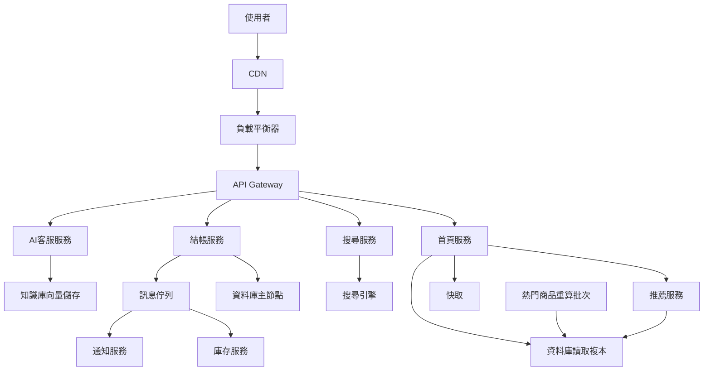

# L5|放手課:給好物市集裝保險絲 🎓

🎯 這課結束時:你會拿到「好物市集」現在的完整架構,親手標出你會在哪裡裝 rate limit、circuit breaker、優雅降級,以及哪些指標該有告警。
🧩 需要先會:這個模組的 L0(事故時間軸)到 L4(所有拼圖)。
📚 想深挖:沒有新概念,這課是把前面四課應用出來。

## 好物市集現在的完整架構

一年多下來,「好物市集」長成了這樣:

## 任務

回到 L0 的事故時間軸,一步一步問自己:**這一步,會被我裝在架構圖哪個位置的哪個保險絲擋下?**時間軸(複習):

1. 03:00 批次工作與線上流量共用同一顆資料庫,統計查詢變慢
2. 03:04 推薦服務因為共用連線池被拖慢
3. 03:06 首頁服務呼叫推薦服務沒設逾時,連線被卡住不放
4. 03:09 連線池被佔滿,連無關的請求一起遭殃
5. 03:12 使用者手動重刷 + 系統自動重試,疊出重試風暴
6. 03:15 結帳出錯,訂單卡在處理中
7. 03:17 「整站錯誤率 > 50%」才觸發告警,慢了十七分鐘

## 自我驗收

對時間軸的**每一步**,說出一句話:「這一步會被我的哪個保險絲擋下」。不需要寫程式,講清楚**放在架構圖的哪個位置、用哪一種保險絲**就算過關。

## 預設路徑(已經標好一半,你來補完)

| 時間軸步驟 | 已標好的保險絲 |
|---|---|
| 1. 批次與線上共用資料庫 | 讓「熱門商品重算批次」改讀資料庫讀取複本,別碰線上流量在用的連線 |
| 2. 推薦服務被拖慢 | ? |
| 3. 首頁呼叫推薦服務卡住 | ? |
| 4. 連線池被佔滿,無關請求遭殃 | 首頁服務對外呼叫每個下游都用各自獨立的連線池,不共用一池,這個技巧叫 **Bulkhead(隔艙隔離)**(跟優雅降級是好搭檔) |
| 5. 重試風暴 | ? |
| 6. 結帳訂單卡住 | ? |
| 7. 告警慢了十七分鐘 | ? |

把問號填完,你就等於幫「好物市集」重新設計了一次這次事故的免疫系統。

## 允許降級交付

七步全部答完當然最好,但這課的重點是「想清楚保險絲該裝在哪」,不是寫一篇完美報告 —— 答對其中四、五步,講得出道理,一樣算完成挑戰。

## 收尾一問

如果只能選一個位置優先裝保險絲(預算/時間有限),你會選架構圖上的哪一個連結?為什麼那裡的槓桿最大?

→ 下一課:全系列收尾 —— 回講這次事故,順便把「好物市集」從 500 人到百萬人的整條路重新走一遍。

## 📇 名詞卡

- **Bulkhead(隔艙隔離)** — 把不同下游的連線池、執行緒池分開,不共用同一份資源 —— 概念借自船艙的防水隔艙:一艙進水,其他艙不受影響。本課故事裡「推薦服務拖垮首頁服務」,根源就是沒有做這層隔離。
  - 想更深可以想想:關鍵字:bulkhead pattern(常與 circuit breaker 並列提到的過載保護手法)。
